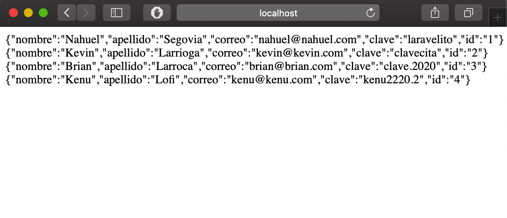

# ApiNOT
> ApiNOT es una REST API que permite crear notas y poder consumirlas desde cualquier lenguaje a través de json. Además de poder crear notas tiene
un sistema de administración en donde se pueden administrar las notas y los usuarios que pueden crearlas.




## Instalación

OS X, Linux, Windows:

```sh
composer install
```


## Ejemplo de uso

CREACIÓN DE USUARIOS:
Para crear usuarios nos dirigimos a /api/usuarios/crear y a través de request enviamos:
```
- nomre
- apellido
- correo
- clave
- user_rol
```

CREACIÓN DE NOTAS
Para crear notas nos dirigimos a /api/notas/crear y a través de request envíamos las siguientes querys:
```
- titulo_publicacion
- contenido_publicacion
- imagen_publicacion
- fecha_publicacion
- user_id
```


## Historial de versiones

* 0.0.1
    * ADD: Podemos ver los usuarios creados a través de json
* 0.0.2
    * ADD: Podemos crear usuarios a través de la api, también mostramos en json el usuario creado
    * ADD: Utilizamos el paquete Bayfront para procesar las peticiones http
* 0.0.3
    * Work in progress

## Autor

(https://twitter.com/d0t__) – 

Distribuido a través de Apache 2.0 ``http://www.apache.org/licenses/LICENSE-2.0.txt`` para más información.
